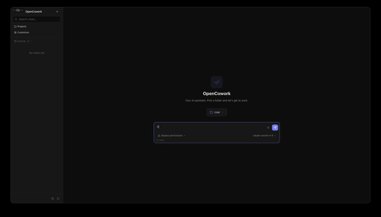
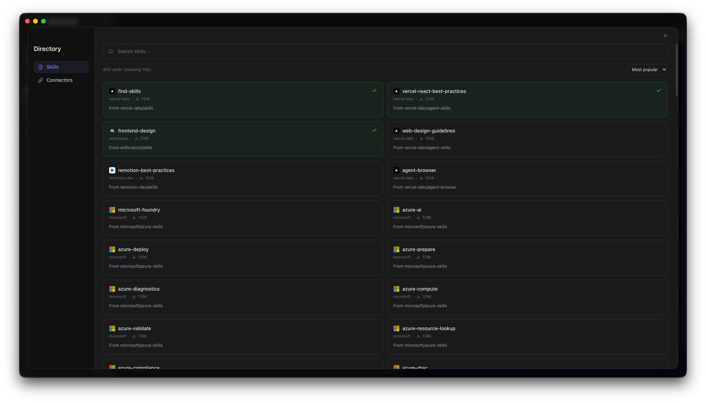

<p align="center">
  
</p>

<h1 align="center">OpenCowork</h1>

<p align="center">
  Your team's AI copilot for everyday work — a friendly desktop app that sits next to you and helps get things done.<br/>
  Built for non-technical staff. No coding required.
</p>

<p align="center">
  <a href="#what-you-can-do">What you can do</a> &middot;
  <a href="#install-it">Install it</a> &middot;
  <a href="#first-launch">First launch</a> &middot;
  <a href="#daily-use-tips">Daily use tips</a> &middot;
  <a href="#your-data">Your data</a> &middot;
  <a href="#for-it-and-developers">For IT & developers</a>
</p>

<p align="center">
  
</p>

---

## What you can do

OpenCowork is a desktop app that gives you an AI teammate you can chat with like a colleague. It helps you draft, research, organise, and produce polished material — from a quick email reply to a one-page brief — without leaving the app.

### Chat that feels like a conversation

Ask anything in plain language. Replies stream in as the assistant thinks, with clean formatting for lists, tables, and quotes. A single button starts and stops each turn, so you're always in control.



### Instant materials, side-by-side

Ask for a flyer, a one-pager, a summary table, a small web form, or a quick chart — and the assistant builds it live in a panel next to your chat. Drag the divider to resize either side. Keep iterating in plain language ("make the header bigger", "use our blue", "add a signature line") until it's right.

Common things people create:

| Example | What it produces |
|---|---|
| "Draft a tidy one-pager for this property" | A ready-to-print HTML page |
| "Turn this into a simple interactive checklist" | A working mini web component |
| "Sketch this workflow as a diagram" | A clean SVG you can export |
| "Preview our staging site" | An embedded browser window |
| "Walk me through this notebook" | A rendered `.ipynb` with outputs |


### Connect your tools

OpenCowork can plug into the services your team already uses — calendars, CRMs, document stores, chat tools, and more — through an open standard called MCP. Browse the built-in catalogue, pick what you need, and the assistant can read, search, and act in those tools on your behalf.


### Ready-made playbooks ("Skills")

Skills are small, reusable instructions that teach the assistant how to handle a recurring task the way *your team* likes it done — writing client updates in your tone of voice, turning meeting notes into a decision log, producing a weekly report from a set of links. Install one from the catalogue, upload a file from a colleague, or write a new one right inside the app.



### Drag, drop, paste

Paste a screenshot straight from your clipboard. Drag a PDF or image from Finder or File Explorer into the chat. Attach documents from the paperclip button. Images appear as thumbnails you can click to view full size.

### The assistant asks, you answer

When the assistant needs a decision — "which of these three drafts should I continue with?" — it shows an inline picker right in the chat with radio buttons, checkboxes, or a free-text field. Pick an option and it continues from where it left off.

### A live view of the current task

A side panel keeps you oriented at a glance:

- How much of the conversation window you've used
- Running cost for the session
- The assistant's live to-do list as it works
- Files it has changed, with add / delete counts
- Which external tools are connected
- The folder this session is working in — click to open it in Finder / File Explorer

### Organise by project

Group related work into **Projects**. Each project has its own folder, its own session history, and its own written instructions so the assistant behaves consistently — for example, always use our house style, always check the brand guide first, always sign off with this signature.

### Bring your own model

Plug in your own keys for the major providers (Anthropic, OpenAI, Google, Groq, xAI, Mistral, OpenRouter) or run everything locally with Ollama, LM Studio, or llama.cpp. If you use Ollama, the list of available models stays in sync automatically.

---

## Install it

Download the right file for your laptop, then open it:

| Platform | Download |
|----------|----------|
| **macOS** (Apple Silicon — M1/M2/M3/M4) | [OpenCowork-macOS.dmg](https://github.com/kuehntechlabs/opencowork/releases/latest/download/OpenCowork-macOS.dmg) |
| **Windows** | [OpenCowork-Windows-Setup.exe](https://github.com/kuehntechlabs/opencowork/releases/latest/download/OpenCowork-Windows-Setup.exe) |

**macOS users — first launch:** The app isn't signed by Apple yet, so macOS will show a security warning the first time you open it. Right-click (or Control-click) the app icon and choose **Open**, then confirm. You only need to do this once.

If that doesn't work, open **Terminal** and paste:

```bash
xattr -cr /Applications/OpenCowork.app
```

---

## First launch

1. **Open OpenCowork.** The welcome screen explains what's where.
2. **Add a provider key.** Go to Settings → Providers and paste in a key from whichever service your team uses. If you don't have one, ask your IT contact.
3. **Say hi.** Type a message in the chat and press enter. That's it.
4. **Optional — connect your tools.** Visit the Tools (MCP) page and install the integrations your team relies on.
5. **Optional — install a Skill or two** from the Skills catalogue to teach the assistant your team's conventions.

The app will also install its built-in helper (`opencode`) for you on first run if it isn't already there.

---

## Daily use tips

- **Speak plainly.** You don't need prompts or tricks. "Shorten this. Keep the bullet points." works.
- **Iterate in the same chat.** Follow-ups are cheaper and faster than starting over, because the assistant already has context.
- **Pin recurring work as a Project.** Put style rules, client background, or "always do X" into the project instructions once, and stop repeating yourself.
- **Let it ask.** If the assistant pops an inline picker, that means it's unsure — answering takes a second and the result will be sharper.
- **Watch the side panel.** If the cost or context bar is climbing fast, it's a good moment to start a new chat.
- **Open the folder.** The little folder button in the chat header jumps straight to the working directory in Finder / File Explorer, handy for grabbing files the assistant just produced.

---

## Your data

- OpenCowork runs on **your** laptop. Your chats, attachments, and projects live locally by default.
- When you send a message, it goes to **the AI provider you configured** (Anthropic, OpenAI, a local model, etc.) — nowhere else.
- Connected tools (MCP) only see what you let them see, and only when the assistant actually calls them. You can disconnect any tool at any time.
- There is no OpenCowork cloud, no telemetry account, no shared history.

If your team has its own data-handling rules, check with IT before plugging in an external provider or an external tool.

---

## Getting help

- **Stuck?** Start a fresh chat and describe what you're trying to do — the assistant is often the fastest help desk.
- **Something broken?** [Open an issue](../../issues) and include what you did, what you expected, what happened, and a screenshot if you have one.
- **Want a feature?** Same place — file an issue and tell us the problem you'd like it to solve, not just the feature you imagine.

---

## For IT and developers

OpenCowork is an Electron desktop app (React 19, Tailwind CSS 4, Zustand, TypeScript) that wraps the open-source [OpenCode](https://github.com/nicholasgriffintn/opencode) agent as a local sidecar process. The renderer talks to the sidecar over HTTP and Server-Sent Events; MCP servers are introspected over stdio or HTTP/SSE.

**Run from source:**

```bash
git clone https://github.com/kuehntechlabs/opencowork.git
cd opencowork
npm install
npm run dev
```

**Other scripts:**

```bash
npm run build         # compile the app
npm run typecheck     # TypeScript check
npm run package:mac   # build signed macOS artifacts (DMG + ZIP)
npm run package:win   # build Windows NSIS installer
```

**Project layout:**

```
src/
├── main/       Electron main process (IPC, sidecar, menus)
├── preload/    Context bridge for secure renderer ↔ main IPC
└── renderer/   React UI (chat, artifacts, MCP, projects, settings)
```

**Contributing:** fork, branch, make sure `npm run typecheck` passes, and open a focused PR against `main`. Keep one feature or fix per PR, and open an issue first for larger changes.

---

## License

[MIT](LICENSE)
