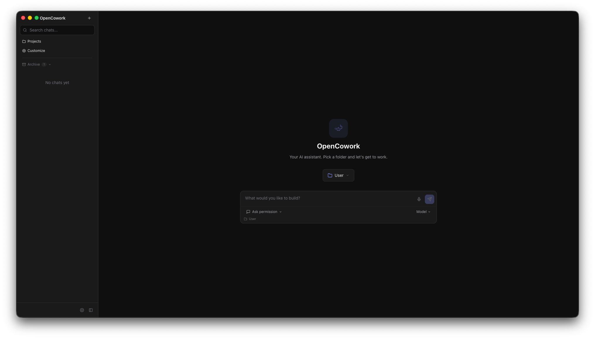
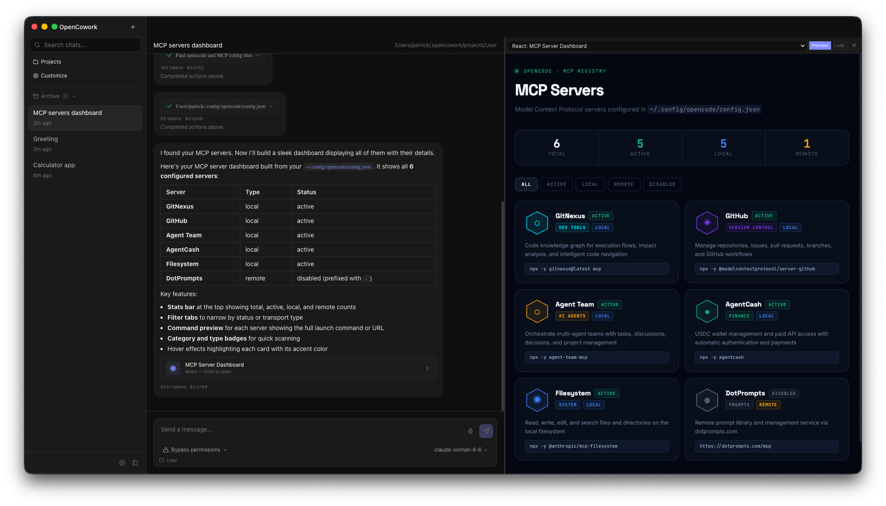
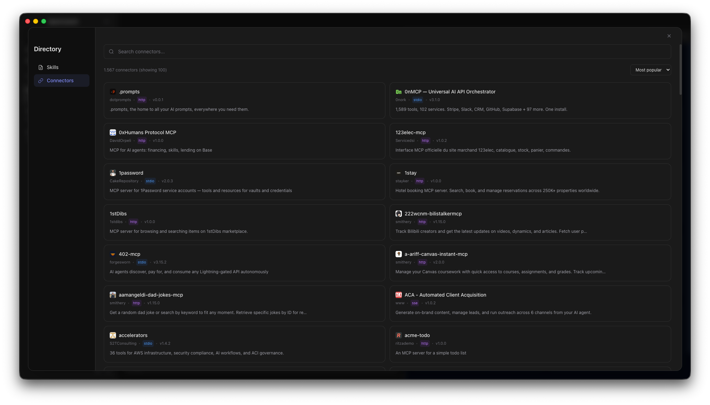

<p align="center">
  
</p>

<h1 align="center">OpenCowork</h1>

<p align="center">
  A desktop UI for <a href="https://github.com/nicholasgriffintn/opencode">OpenCode</a> — the open-source AI coding agent.<br/>
  Built with Electron, React 19, and Tailwind CSS 4.
</p>

<p align="center">
  <a href="#features">Features</a> &middot;
  <a href="#installation">Installation</a> &middot;
  <a href="#development">Development</a> &middot;
  <a href="#architecture">Architecture</a> &middot;
  <a href="#contributing">Contributing</a> &middot;
  <a href="#license">License</a>
</p>

<p align="center">
  
</p>

---

## Features

### Chat Interface

Real-time conversational UI for interacting with AI coding agents. Messages stream in via Server-Sent Events with full Markdown rendering, syntax-highlighted code blocks, and tool call visualization.

<!-- TODO: Add screenshot of chat interface -->
<!--  -->

### Live Artifacts

The AI can generate interactive artifacts that render in a resizable panel alongside the chat:

| Type | Description |
|------|-------------|
| **HTML** | Full HTML pages rendered in a sandboxed iframe with Tailwind CSS |
| **React** | JSX/TSX components transpiled on-the-fly with React 19 runtime |
| **SVG** | Scalable vector graphics |
| **Browser Preview** | Embedded webview for localhost dev servers |
| **Jupyter Notebooks** | Parsed and rendered `.ipynb` files with outputs |

Artifacts are auto-detected from streaming responses. A fallback detector also catches code blocks and localhost URLs from tool output.

<!-- TODO: Add screenshot or GIF of artifact rendering -->
<!--  -->

### MCP Marketplace

Browse and install [MCP servers](https://modelcontextprotocol.io/) from the official registry. Supports local (stdio) and remote (HTTP/SSE) transports with live introspection of tools, prompts, and resources.

<!-- TODO: Add screenshot of MCP marketplace -->
<!--  -->

### Skills & Customization

Discover, install, and manage AI skills. Customize your agent's behavior with custom instructions and skill configurations.

### Projects

Organize work into projects with dedicated agent instructions (`agents.md`), directory management, and session history.

### Provider Configuration

Connect your own API keys for Anthropic, OpenAI, Google, Groq, xAI, Mistral, or OpenRouter. Also supports local models via Ollama, LM Studio, and llama.cpp.

---

## Installation

### Download

<!-- TODO: Add download links for latest release -->
<!-- Download the latest release for your platform:
- **macOS** — [OpenCowork.dmg](https://github.com/your-org/opencowork/releases/latest)
- **Windows** — [OpenCowork-Setup.exe](https://github.com/your-org/opencowork/releases/latest) -->

Builds are available for macOS and Windows. Check the [Releases](../../releases) page.

### Prerequisites

OpenCowork requires the [OpenCode](https://github.com/nicholasgriffintn/opencode) CLI to be installed:

```bash
npm install -g opencode-ai@latest
```

> The app will attempt to install this automatically on first run if it's not found.

---

## Development

### Setup

```bash
git clone https://github.com/kuehntechlabs/opencowork.git
cd opencowork
npm install
```

### Run

```bash
npm run dev
```

This starts the Electron app with hot reload for the renderer process.

### Build

```bash
npm run build
```

### Package

```bash
npm run package:mac   # macOS (DMG + ZIP)
npm run package:win   # Windows (NSIS installer)
```

### Type Check

```bash
npm run typecheck
```

---

## Architecture

OpenCowork follows a standard Electron multi-process architecture:

```
┌─────────────────────────────────────────────────┐
│                  Main Process                   │
│  Window management, IPC, sidecar control        │
│                                                 │
│  ┌─────────────┐  ┌──────────────────────────┐  │
│  │  Sidecar    │  │  MCP Introspection       │  │
│  │  (OpenCode) │  │  (stdio / HTTP clients)  │  │
│  └──────┬──────┘  └──────────────────────────┘  │
│         │ HTTP + SSE                            │
├─────────┼───────────────────────────────────────┤
│         │        Preload (Context Bridge)       │
├─────────┼───────────────────────────────────────┤
│         ▼        Renderer Process               │
│  ┌────────────────────────────────────────────┐ │
│  │  React 19 + Zustand + Tailwind CSS 4       │ │
│  │                                            │ │
│  │  Chat ─── Artifacts ─── MCP ─── Projects   │ │
│  └────────────────────────────────────────────┘ │
└─────────────────────────────────────────────────┘
```

### Project Structure

```
src/
├── main/               # Electron main process
│   ├── index.ts        # App entry, IPC handlers
│   ├── sidecar.ts      # OpenCode process management
│   ├── mcp-inspect.ts  # MCP server introspection
│   └── menu.ts         # Application menu
├── preload/
│   └── index.ts        # Context bridge (secure IPC)
└── renderer/           # React UI
    ├── api/            # HTTP client, SSE, types
    ├── stores/         # Zustand state management
    ├── components/
    │   ├── chat/       # Chat UI (messages, input, tools)
    │   ├── artifacts/  # Artifact renderers (HTML, React, SVG)
    │   ├── layout/     # App layout, sidebar, panels
    │   ├── pages/      # Customize, projects, directory
    │   └── settings/   # Provider configuration
    ├── data/           # Marketplace catalog, registry fetch
    └── utils/          # Artifact detection, prompts
```

### Tech Stack

| Layer | Technology |
|-------|-----------|
| Desktop | Electron 41 |
| UI | React 19, Tailwind CSS 4 |
| State | Zustand |
| Build | electron-vite, electron-builder |
| Language | TypeScript |
| Backend | OpenCode (spawned as sidecar process) |

---

## Contributing

Contributions are welcome! Here's how to get started:

1. **Fork** the repository
2. **Create a branch** for your feature or fix (`git checkout -b my-feature`)
3. **Make your changes** and ensure `npm run typecheck` passes
4. **Commit** with a clear message describing what and why
5. **Open a Pull Request** against `main`

### Guidelines

- Keep PRs focused — one feature or fix per PR
- Follow the existing code style (TypeScript, functional React components, Zustand stores)
- Test your changes on both macOS and Windows if possible
- For large changes, open an issue first to discuss the approach

### Reporting Issues

Found a bug or have a feature request? [Open an issue](../../issues) with:
- Steps to reproduce (for bugs)
- Expected vs actual behavior
- Screenshots if applicable
- Your OS and app version

---

## License

[MIT](LICENSE)
